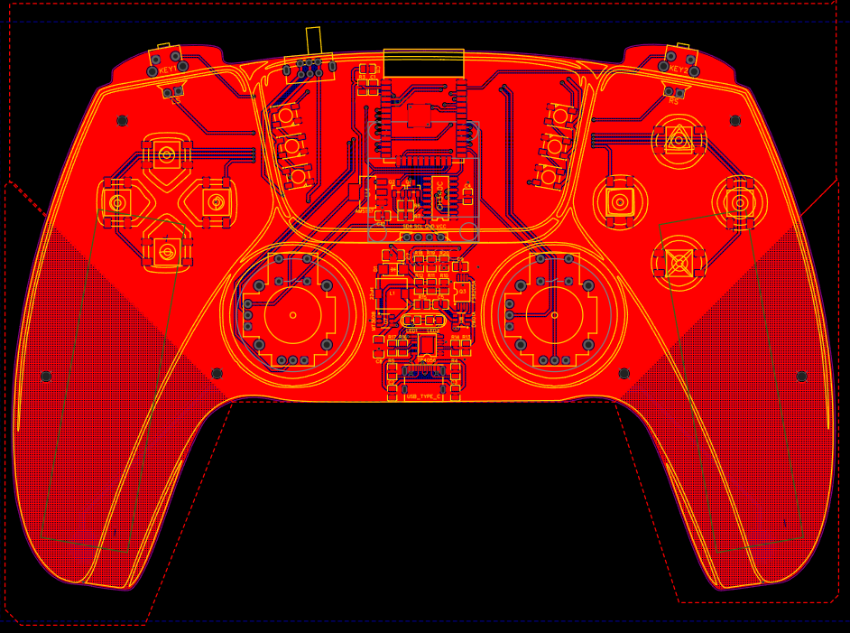
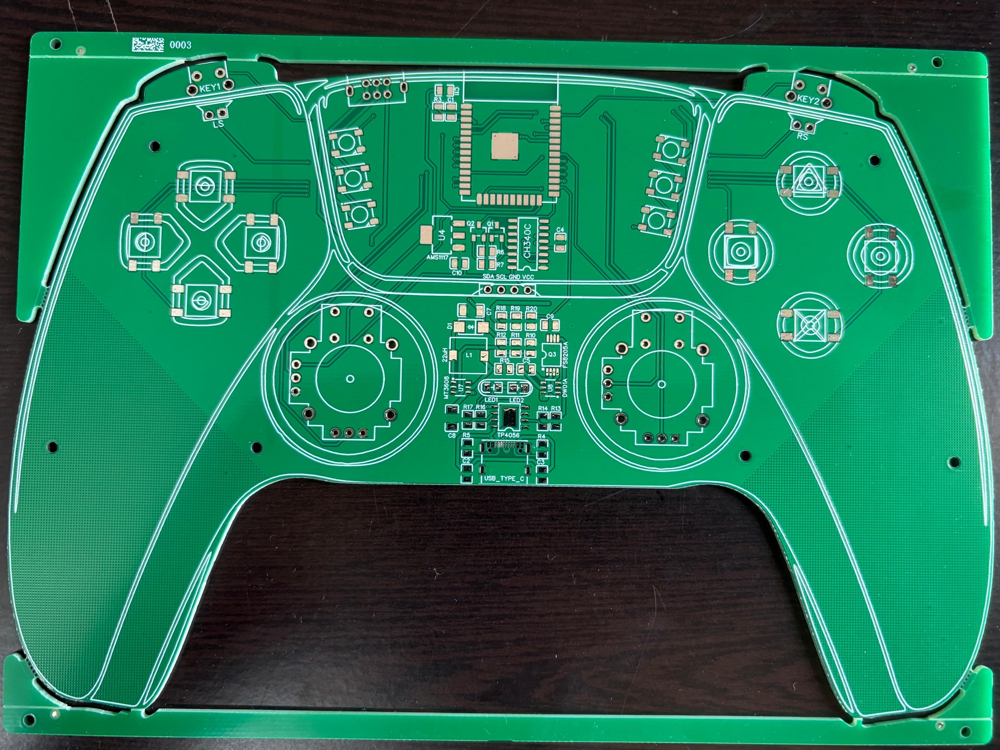
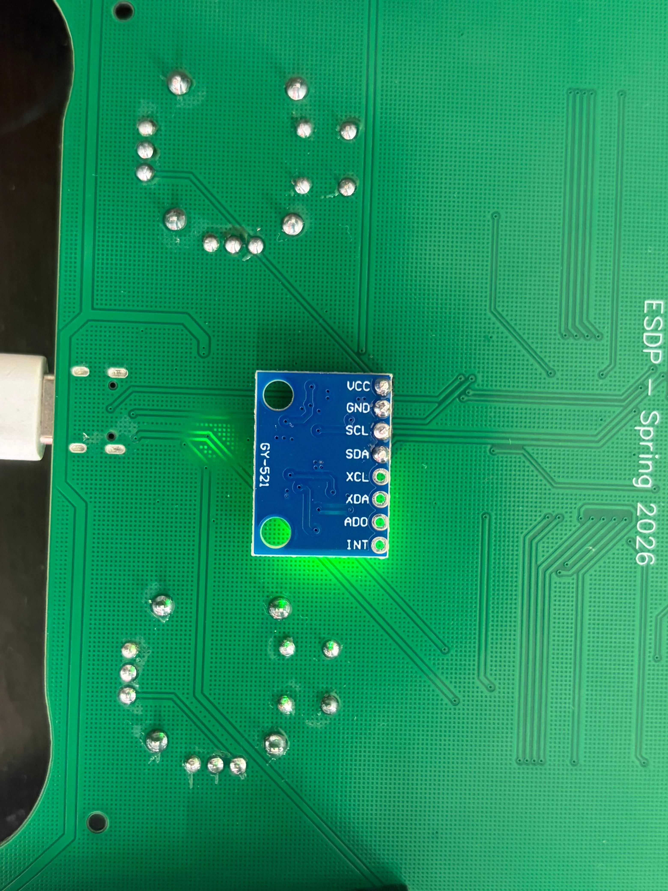

# ESP32-Based BLE Gaming Controller

## Overview

This project presents the design and implementation of a custom Bluetooth Low Energy (BLE) gaming controller based on the ESP32 platform. The system integrates multiple user input mechanisms including joysticks, push buttons, directional pad (D-pad), and trigger switches, along with onboard power management and USB interfacing.

The project was developed as part of the **Electronic System Design Project Lab (Spring Semester 2026)** at IIT Hyderabad. It encompasses complete hardware design (schematic and PCB), embedded firmware development, and system-level testing.

---

## Objectives

- Design a fully functional BLE gaming controller using ESP32
- Develop a custom PCB integrating all controller subsystems
- Implement BLE HID communication for wireless gaming
- Integrate motion sensing using MPU6050
- Provide visual feedback using NeoPixel LEDs
- Validate hardware and firmware performance 

---


# System Architecture

The controller consists of five major subsystems:

## 1. Input Subsystem

Responsible for acquiring user inputs.

### Components

- Dual Analog Joysticks
- Trigger Buttons (LT, RT)
- Action Buttons (R1–R4)
- Directional Pad (D-pad)
- Joystick Push Buttons (LS, RS)

---

## 2. Motion Sensing Subsystem

### MPU6050 Gyroscope

Provides motion-based camera control and aiming assistance.

| Signal | ESP32 Pin |
|----------|----------|
| SDA | GPIO21 |
| SCL | GPIO22 |

The gyroscope is interfaced using the I2C protocol.

---

## 3. Processing Unit

### ESP32-WROOM-32

Responsible for:

- Input acquisition
- Signal processing
- Deadzone compensation
- Motion sensing
- LED control
- BLE communication

---

## 4. Communication Subsystem

### BLE HID Gamepad

The ESP32 operates as a Bluetooth HID gamepad and transmits:

- Button states
- D-pad states
- Joystick positions
- Motion control data

to gaming devices and computers.

---

## 5. Power Management

The controller is powered by a rechargeable Li-Ion battery and includes:

- TP4056 charging circuit
- DW01A battery protection IC
- FS8205A protection MOSFET
- MT3608 boost converter
- AMS1117-3.3 voltage regulator

---


## Hardware Design

### Schematic

The complete circuit schematic is shown below:


---

### PCB Layout

#### Design (EasyEDA)


#### Fabricated PCB (Before Assembly)


#### Assembled PCB


---

## Key Components

| Component            | Description                          |
|---------------------|--------------------------------------|
| ESP32-WROOM-32      | Main microcontroller with BLE        |
| CH340C              | USB-to-Serial interface              |
| AMS1117-3.3         | Voltage regulator                    |
| TP4056              | Li-ion battery charger               |
| DW01A + FS8205A     | Battery protection circuitry         |
| MT3608              | DC-DC boost converter                |
| Analog Joysticks    | Dual-axis input devices              |
| Push Buttons        | User input switches                  |
| USB Type-C          | Power and programming interface      |

---

---

# Firmware Architecture

The firmware performs the following operations continuously:

1. Read analog joystick values
2. Read button states
3. Acquire gyroscope data
4. Apply deadzone compensation
5. Apply signal smoothing
6. Combine joystick and gyroscope inputs
7. Update LED status
8. Send BLE HID reports

---

# Functional Modules

## Analog Joystick Processing

Two analog joysticks are used for movement and camera control.

### Features

- 12-bit ADC resolution
- Center calibration
- Deadzone compensation
- Signal smoothing
- BLE HID mapping

### Deadzone Compensation

To eliminate unwanted drift around the center position:

```cpp
if (abs(lx) < deadzone) lx = 0;
if (abs(ly) < deadzone) ly = 0;
```

### Signal Smoothing

```cpp
lx = (prevLX * 0.7) + (lx * 0.3);
ly = (prevLY * 0.7) + (ly * 0.3);
```

This reduces jitter and provides smoother movement.

---

## Trigger System

The controller includes two trigger buttons:

- LT (Left Trigger)
- RT (Right Trigger)

### HID Mapping

| Trigger | HID Button |
|----------|----------|
| LT | BUTTON_7 |
| RT | BUTTON_8 |

### Implementation

```cpp
if (currentLT == LOW)
{
    bleGamepad.press(BUTTON_7);
}
else
{
    bleGamepad.release(BUTTON_7);
}
```

```cpp
if (currentRT == LOW)
{
    bleGamepad.press(BUTTON_8);
}
else
{
    bleGamepad.release(BUTTON_8);
}
```

---

## Action Buttons

Four action buttons are implemented.

| Physical Button | HID Button |
|----------------|------------|
| R1 | BUTTON_5 |
| R2 | BUTTON_2 |
| R3 | BUTTON_1 |
| R4 | BUTTON_4 |

The buttons are continuously scanned and transmitted over BLE.

---

## D-Pad System

Four buttons provide directional control.

### Supported Directions

- Up
- Down
- Left
- Right

### Example

```cpp
if (digitalRead(L1) == LOW)
{
    bleGamepad.setHat1(DPAD_UP);
}
```

The D-pad is transmitted using the HID Hat Switch interface.

---


---

# MPU6050 Gyroscope Integration

## Hardware

The MPU6050 is a 6-axis IMU consisting of:

- 3-axis accelerometer
- 3-axis gyroscope

### Gyroscope Module



---

## Purpose

The gyroscope is used to provide motion-based camera control.

It supplements the right joystick and enables more precise aiming.

---

## Sensor Acquisition

```cpp
sensors_event_t a, g, t;
mpu.getEvent(&a, &g, &t);
```

This retrieves accelerometer and gyroscope measurements.

---

## Deadzone Compensation

Small sensor noise around zero is removed using:

```cpp
if (abs(gyro) < gyroDeadzone)
    gyro = 0;
```

---

## Motion Scaling

The angular velocity is scaled to the HID range:

```cpp
int gyroRX = -gyro * gyroSensitivity;
```

where:

```cpp
gyroSensitivity = 4700.0;
```

---

## Combining Joystick and Gyroscope

The right joystick and gyroscope are combined:

```cpp
long combinedRX = -(long)rx + gyroRX;
long combinedZ  = (long)(-ry) + gyroZAxis;
```

This allows:

- Right Joystick → Normal camera movement
- Gyroscope → Fine motion control

---

## BLE Axis Mapping

```cpp
bleGamepad.setRX(combinedRX);
bleGamepad.setZ(combinedZ);
```

The final camera movement is transmitted as HID rotational axes.

---

# NeoPixel LED Feedback System

The controller includes six WS2812 RGB LEDs.

---

## Startup Animation

During boot, LEDs illuminate sequentially using a rainbow pattern.

```cpp
leds[i] = CHSV(i * 40, 255, 255);
```

This provides visual confirmation of successful startup.

---

## BLE Connection Status

### Disconnected State

A moving blue LED animation indicates that the controller is waiting for a BLE connection.

```cpp
showDisconnected();
```

### Connected State

When connected:

```cpp
showConnected();
```

All LEDs turn green.

---

## Trigger Feedback

### LT Pressed

All LEDs become yellow.

```cpp
fill_solid(leds, NUM_LEDS, CRGB::Yellow);
```

### RT Pressed

All LEDs flash blue.

```cpp
fill_solid(leds, NUM_LEDS, CRGB::Blue);
```

This provides immediate visual feedback during gameplay.

---

# GPIO Mapping

| Function | GPIO |
|-----------|------|
| LT | 15 |
| RT | 23 |
| LH | 34 |
| LV | 35 |
| LS | 2 |
| RH | 39 |
| RV | 36 |
| RS | 19 |
| D-Pad Up | 32 |
| D-Pad Left | 33 |
| D-Pad Down | 27 |
| D-Pad Right | 14 |
| R1 | 18 |
| R2 | 5 |
| R3 | 17 |
| R4 | 16 |
| NeoPixel Data | 13 |
| MPU6050 SDA | 21 |
| MPU6050 SCL | 22 |

---

# Testing and Validation

| Module | Status |
|----------|----------|
| BLE Connectivity | Verified |
| Action Buttons | Verified |
| Trigger Buttons | Verified |
| D-Pad | Verified |
| Joystick Buttons | Verified |
| Left Joystick | Verified |
| Right Joystick | Verified |
| Deadzone Compensation | Verified |
| MPU6050 Integration | Verified |
| Motion Control | Verified |
| NeoPixel Feedback | Verified |

---

### Demo Video 1

[Controller Demonstration](videos/demo1.mp4)

Demonstrates:

- BLE pairing
- Button testing
- D-pad operation
- LED feedback

---

### Demo Video 2

[Gyroscope Demonstration](videos/demo2.mp4)

Demonstrates:

- Motion sensing
- Camera movement
- Gyroscope-assisted aiming

---

## Team Members

- Rishikesh — EE24BTECH11204  
- Vighnesh — EE24BTECH11205  
- Kedar — EE24BTECH11030  
- Mahendar — EE24BTECH11213  
- Ashok — EE24BTECH11208  
- Madhukar — EE24BTECH11218  

