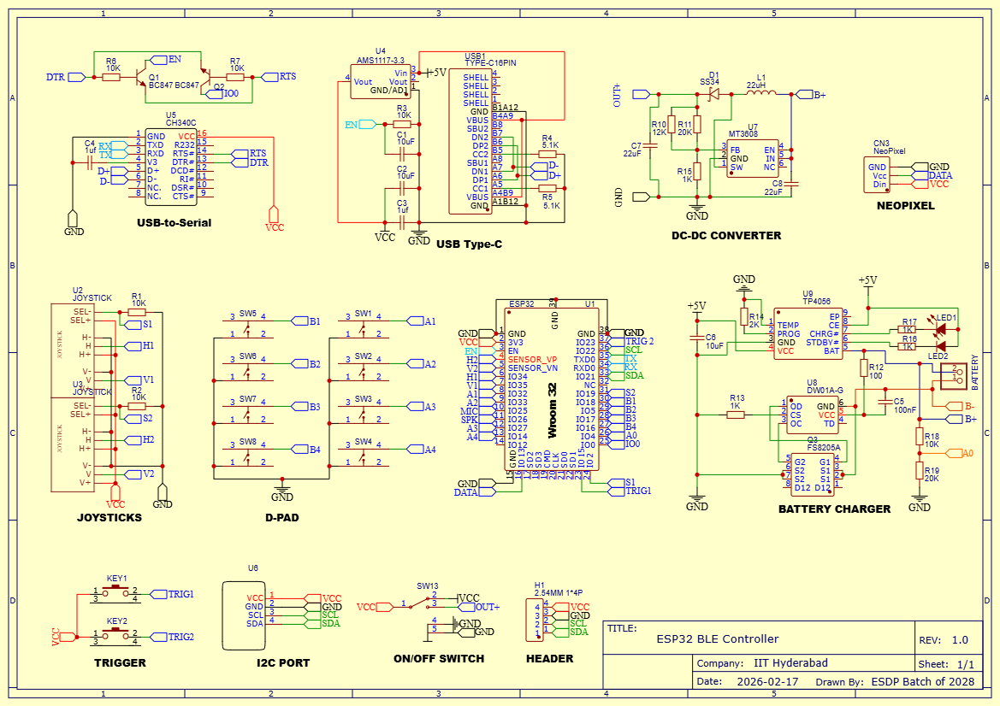
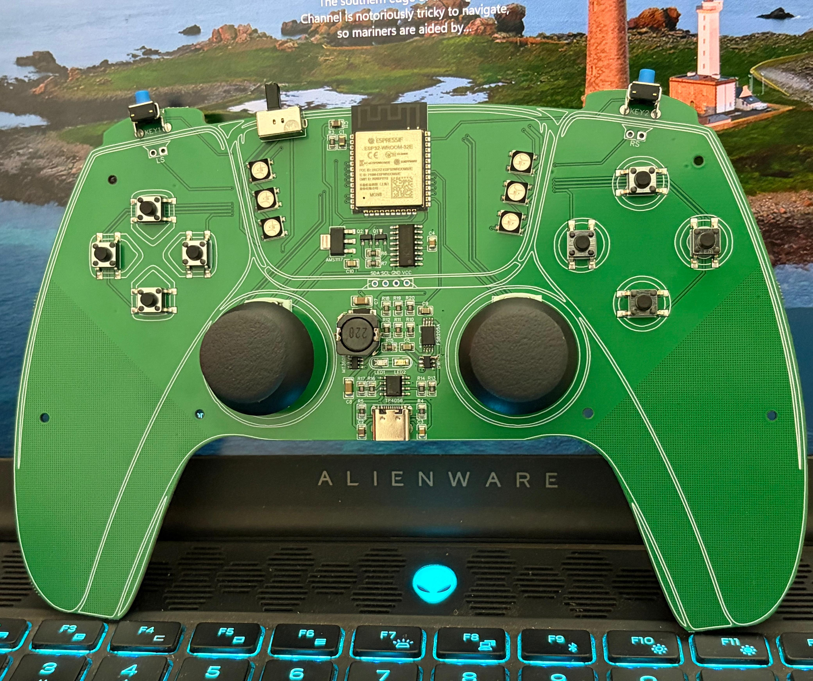

# ESP32-Based BLE Gaming Controller

## Overview

This project presents the design and implementation of a custom Bluetooth Low Energy (BLE) gaming controller based on the ESP32 platform. The system integrates multiple user input mechanisms including joysticks, push buttons, directional pad (D-pad), and trigger switches, along with onboard power management and USB interfacing.

The project was developed as part of the **Electronic System Design Project Lab (Spring Semester 2026)** at IIT Hyderabad. It encompasses complete hardware design (schematic and PCB), embedded firmware development, and system-level testing.

---

## Objectives

- Design a fully functional BLE-based gaming controller using ESP32  
- Develop a custom PCB integrating input systems and power management  
- Implement reliable input acquisition from joysticks and switches   
- Validate system performance through hardware testing  

---

## Current Implementation Status

### Functional Components

- Digital buttons (B1–B4): Operational  
- Directional pad (D-pad): Operational  
- Trigger buttons: Operational  
- Joystick push buttons: Operational  
- Analog joystick position sensing: Operational (Facing drift issues) 
- BLE communication: Operational  

### Known Issues

- Analog joystick drift observed near center position  
- Software-based correction (deadzone and calibration) pending  

### Pending 

- Integration of gyroscope (I2C-based IMU)  

---

## System Architecture

The system is organized into the following functional blocks:

### 1. Input Subsystem
- Analog joysticks connected to ESP32 ADC pins  
- Digital inputs from buttons, D-pad, and triggers via GPIO  

### 2. Processing Unit
- ESP32-WROOM-32 module  
- Handles input acquisition, processing, and BLE communication  

### 3. Communication
- BLE HID profile for wireless controller interfacing  

### 4. Power Management
- Li-ion battery supply  
- TP4056-based charging circuit  
- Protection circuitry (DW01A + FS8205A)  
- Boost converter (MT3608) to maintain stable output voltage  

### 5. Expansion Interfaces
- I2C header for gyroscope integration 
- Neopixel interface for visual feedback  

---

## Hardware Design

### Schematic

The complete circuit schematic is shown below:

---

### PCB Layout

#### Design (EasyEDA)

#### Fabricated PCB (Before Assembly)

#### Assembled PCB

---

## Key Components

| Component            | Description                          |
|---------------------|--------------------------------------|
| ESP32-WROOM-32      | Main microcontroller with BLE        |
| CH340C              | USB-to-Serial interface              |
| AMS1117-3.3         | Voltage regulator                    |
| TP4056              | Li-ion battery charger               |
| DW01A + FS8205A     | Battery protection circuitry         |
| MT3608              | DC-DC boost converter                |
| Analog Joysticks    | Dual-axis input devices              |
| Push Buttons        | User input switches                  |
| USB Type-C          | Power and programming interface      |

---

### 3. Gyroscope Integration

A gyroscope is planned for motion-based input.

**Current Status:**
- Not yet implemented  

**Future Plan:**
- Integrate via I2C interface  
- Update firmware for sensor fusion and motion tracking  

---

## Testing and Validation

| Module             | Status       |
|-------------------|-------------|
| Buttons           | Verified     |
| D-pad             | Verified     |
| Triggers          | Verified     |
| Joystick Buttons  | Verified     |
| Joystick Axes     | Verified     |
| BLE Connectivity  | Verified     |
| Drift Correction  | Pending      |
| Gyroscope         | Pending      |

---

## Firmware Overview

The firmware is responsible for:

- Reading analog and digital inputs  
- Processing joystick data  
- Handling BLE communication  
- Mapping inputs to gamepad controls  

---

## Repository Structure

## Course Information

This project was carried out as part of:

**Electronic System Design Project Lab**  
Spring Semester 2026  
Indian Institute of Technology Hyderabad  

---

## Team Members

- Rishikesh — EE24BTECH11204  
- Vighnesh — EE24BTECH11205  
- Kedar — EE24BTECH11030  
- Mahendar — EE24BTECH11213  
- Ashok — EE24BTECH11208  
- Madhukar — EE24BTECH11218  

